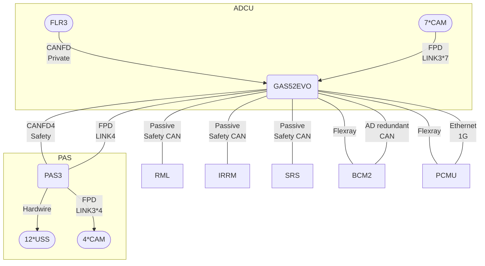

```mermaid
%%{init: {'theme': 'nuetral' } }%%

graph TB
    s12([12*USS])
    WAM([4*CAM])
    CAM([7*CAM])
    FLR([FLR3])
    RML
    IRRM
    SRS

    PAS3(PAS3)
    GAS(GAS52EVO)

    subgraph PAS
        PAS3-->|Hardwire|s12
        PAS3-->|FPD<br/>LINK3*4|WAM
    end

    subgraph ADCU
        FLR-->|CANFD<br/>Private|GAS
        CAM-->|FPD<br/>LINK3*7|GAS
    end
    GAS---|Passive<br/>Safety CAN|RML
    GAS---|Passive<br/>Safety CAN|IRRM
    GAS---|Passive<br/>Safety CAN|SRS
    GAS---|Flexray|BCM2
    GAS---|AD redundant<br/>CAN|BCM2
    GAS---|Flexray|PCMU
    GAS---|Ethernet<br/>1G|PCMU
    GAS---|CANFD4<br/>Safety|PAS3
    GAS---|FPD<br/>LINK4|PAS3
```
