---
theme: default
---

```mermaid
%%{init: {'theme': 'forest' } }%%
gantt 
dateFormat HH:mm
axisFormat %H:%M
Initial milestone : milestone, m1, 00:00,2min
taska2 : 10min
taska3 : 5min
Final milestone : milestone, m2, 24:00, 2min
```

```mermaid
gantt
    dateFormat  M
    axisFormat %m%d
    title Adding GANTT diagram functionality to mermaid

    section A section
    Completed task            :done,    des1, 2014-01-06,2014-01-08
    Active task               :active,  des2, 2014-01-09, 3d
    Future task               :         des3, after des2, 5d
    Future task2               :         des4, after des3, 5d

    section Critical tasks
    Completed task in the critical line :crit, done, 2014-02,24h
    Implement parser and jison          :crit, done, after des1, 2d
    Create tests for parser             :crit, active, 3d
    Future task in critical line        :crit, 5d
    Create tests for renderer           :2d
    Add to mermaid                      :1d

    section Documentation
    Describe gantt syntax               :active, a1, after des1, 3d
    Add gantt diagram to demo page      :after a1  , 20h
    Add another diagram to demo page    :doc1, after a1  , 48h

    section Last section
    Describe gantt syntax               :after doc1, 3d
    Add gantt diagram to demo page      : 20h
    Add another diagram to demo page    : 48h
```



				apr-23				maj-23					jun-23				jul-23				aug-23															
	CW11	CW12	CW13	CW14	CW15	CW16	CW17	CW18	CW19	CW20	CW21	CW22	CW23	CW24	CW25	CW26	CW27	CW28	CW29	CW30	CW31	CW32	CW33	CW34	CW35	CW36	CW37	CW38	CW39	CW40	CW41	CW42	CW43			
Milestones														"Critical for test resources for ""1st issue fix"""		HWP, NOP, if car supports it by w22									MRD 35d3						CRB 41d3					
ADCU Function releases	V2R1			V2R1.2		CEVT FB		V2R2			V3R1		CEVT FB	Bug fix requested		V3R2		CEVT FB	V4R1 SOP.		V4R2		CEVT FB		V4R3 H2 +Final Release											
	CMSF, TSI, LKA, ACC			Bugfix TSI				"HWA, LCA
Bug-fix: CMSF, LKA, TSI, ACC"		Final check CMSF, LKA, TSI	"HWA+, DOW, FCTA, RSPA, TLA
Bug fix: HWA, LCA
Checkpoint PEB, RCTA status"			"1: DOW, FCTA, HWA+, RSPA, TLA
2: HWA, LCA"		Bugfixes (+ requested to impl. RCTA, PEB, CMSR, ELKA, APA/RPA - not confirmed)			

CMSF, TSI, LKA, LCA, DOW, HWA, ACC, FCTA, TLA, RSPA (HWP, NOP) (All ML5)		
CMSR, ELKA, APA, RPA (full), RCTA, PEB				
CMSF, LKA, TSI, HWA, HWA+, RSPA, CMSR, ELKA, APA, RPA, RCTA, PEB											
AVL TT #534					TSI not ready to test		

																													
Number plates to be sent									Vehicle issues	Vehicle issues																										
CCP to be changed					Delivery service	Transport																														
																																				
AVL VP2 #330																																				
																																				
																																				
																																				
Include SLIM logging system?																																				
							Continue in #330 when #532 is blocked for DDAW																													
AVL TT1 #532																																				
DHU 1032																																				
																																				
CEVT VP2 #336																																				
SLIM SYSTEM w16?																																				
CEVT TT #536 (Replace #336)																																				
CEVT VP2 #159 (Full logg)					ETD CN	Transit		Delivery service																												
ARRIVAL w14?																																				
Temp. Car TT #521					TSI testing	TSI testing																														
MBLY (/CEVT) TT #520							Installation  FULL		TSI testing Spain																											
Full logging system						TSI testing Germany																														
																																				
																																				
Homologation test													CMSF, LKA, TSI, DDAW												CMSR, HWA base/+, APA, RSPA											
Performance test loop																																				
Acceptance test loop																																				
Quality Testing																																				
Homologation test																																				
																																				
OPEN TOPICS																																				
Red functions in w26 not yet approved to be released w26																																				
CEVT holiday during a crowded inhouse test period																																				
CMSR 1loop is purchased from AVL																																				
PEB inhouse or must be sourced? Souced according to Zain																																				
APA/RPA inhouse or must be sourced?																																				
RCTA inhouse or must be sourced?																																				
ELKA not part of LKA testing - how to proceed?																																				
TSI testing -Task Force, Emelie (Erik)																																				
ADG - when to run the 2 loops?																																				
Q test - on what release shall we run?																																				
1 SLIM system arrived w14d4 (at AVL now)																																				
2 SLIM system to arrive w17? (arrived at Säve yet?)																																				
																																				
Vehicles to be confirmed, detail planning needed of those. -Looks OK now																																				
Vehicle Delivery and SW delivery mis-match	MBLY must shorten the time.  
MBLY does not comply to Design Review	MBLY must comply to Design Review
MBLY does not send the MAP requirements	MBLY must send us the MAP requirements
MBLY does not comply to our virtual test plan	MBLY must send us the required data

Phase	Trim Level	Engine	Battery	Driveline	Test categories	Test Item	Share		Res.Dep	Res.Person	Test.Dep	Test Site
VP1	Standard RWD	单电机	78KWh	RWD	ADAS	CEVT Winter test	专用	1	CEVT	Jaewoo	CEVT	EU
VP2	Flagship AWD	双电机	103.8KWh	AWD	ADAS	Verfication (such as TSI…)	专用	1	CEVT	Jaewoo	CEVT	EU
TT	Flagship AWD	双电机	103.8KWh	AWD	ADAS	EU-NCAP safety tests (Active safety part)	专用	1	CEVT	Jaewoo	CEVT	EU
TT	Standard RWD	单电机	78KWh	RWD	ADAS	EU-NCAP Assisted driving tests	专用	1	CEVT	Jaewoo	CEVT	EU
TT	Flagship AWD	双电机	103.8KWh	AWD	ADAS	Pre-homologation	专用	1	CEVT	Jaewoo	CEVT	EU
TT	Standard RWD	单电机	78KWh	RWD	ADAS	Q-TEST	专用	1	CEVT	Jaewoo	CEVT	EU
TT	Flagship AWD	双电机	103.8KWh	AWD	ADAS	Q-TEST	专用	1	CEVT	Jaewoo	CEVT	EU
PP	Standard RWD	单电机	78KWh	RWD	ADAS	Q-TEST	专用	1	CEVT	Jaewoo	CEVT	EU
PP	Flagship AWD	双电机	103.8KWh	AWD	ADAS	Q-TEST	专用	1	CEVT	Jaewoo	CEVT	EU


Function	Regulation	Logic Supplier	Test Time(Week)
CMSF-Collision Mitigation Support Front	R152	MBLY	8
CMSR-Collision Mitigation Support Rear	R48	MBLY	8
LKA-Lane Keeping Aid	2021/646, R79	MBLY	8
EMA-Evasive Manoeuvre Assist		MBLY	4
FCTA-Front Cross Traffic Alert		MBLY	4
RCTA-Rear Cross Traffic Alert		MBLY	4
DOW-Door Open Warning		MBLY	4
APA-Autonomous Parking (APA)	ECE R79	Ofilm	8
RPA-Remote Parking Assist	ECE R79	Ofilm	8
PEB-Parking Emergency Brake		Ofilm	4
ACC-Adaptive Cruise Control		MBLY	4
HWA Base-HighWay Assist Base	ECE R79	MBLY	8
LCA-Lane Change Assist		MBLY	4
TSI-Traffic Sign Information	2021/1958	MBLY	8
TLA-Traffic Light Attention		MBLY	4
APB-Automatic Preventative Braking		MBLY	4
HWA Plus-HighWay Assist Plus	ECE R79	MBLY	8
ADB(HLB)-Gradual Adaptation of the Driving Beam	ECE R48.07	MBLY	8
VPA-Visual Park Assist	ECE R158	Ofilm	8
PAF-Parking Assist Front		Ofilm	4
PAR-Parking Assist Rear	ECE R158	Ofilm	8
HWP-High Way polit	R79	MBLY	8
NZP-Navigate on Pilot	R79	MBLY	8
DMS	R157	SY	8
