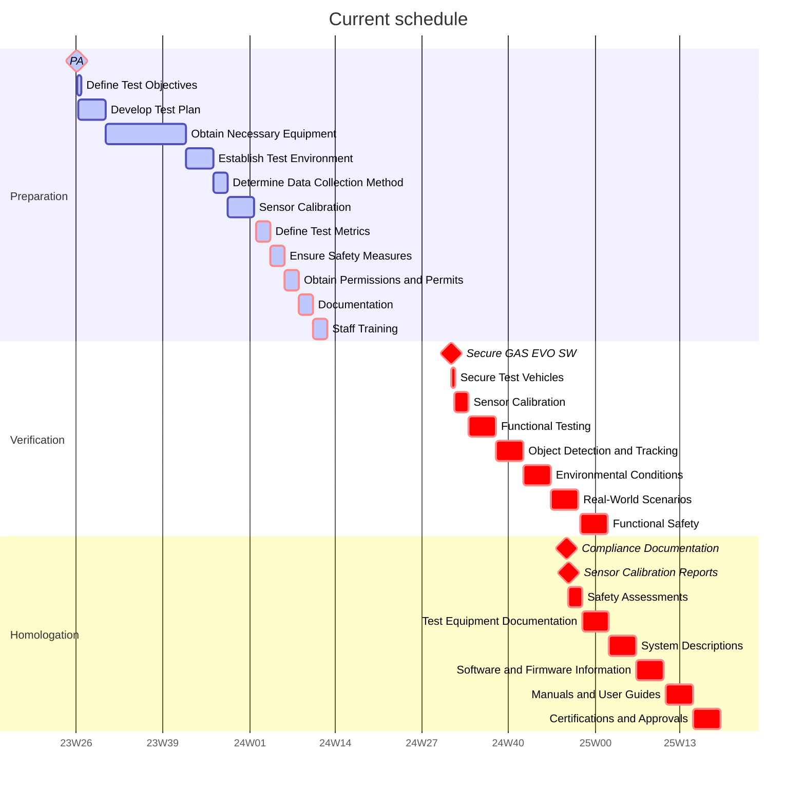

```mermaid
%%{init: {'theme': 'nuetral' } }%%
gantt
    dateFormat YYWW
    axisFormat %yW%W
    title Current schedule
    

	section Preparation
	PA	: crit, active, milestone, 2023-07-01,1d
	Define Test Objectives	: active, des1, 2023-07-02,4d
	Develop Test Plan	: active, des2, 2023-07-03,29d
	Obtain Necessary Equipment	: active, des3, 2023-08-01,85d
	Establish Test Environment	: active, des4, 2023-10-25,29d
	Determine Data Collection Method	: active, des5, 2023-11-23,15d
	Sensor Calibration	: active, des6, 2023-12-08,29d
	Define Test Metrics	: crit, active, des7, 2024-01-08,15d
	Ensure Safety Measures	: crit, active, des8, 2024-01-23,15d
	Obtain Permissions and Permits	: crit, active, des9, 2024-02-07,15d
	Documentation	: crit, active, des10, 2024-02-22,15d
	Staff Training	: crit, active, des11, 2024-03-08,15d

	section Verification
	Secure GAS EVO SW	: crit, milestone, 2024-08-01,1d
	Secure Test Vehicles	: crit, des1, 2024-08-02,4d
	Sensor Calibration	: crit, des2, 2024-08-05,15d
	Functional Testing	: crit, des3, 2024-08-20,29d
	Object Detection and Tracking	: crit, des4, 2024-09-18,29d
	Environmental Conditions	: crit, des5, 2024-10-17,29d
	Real-World Scenarios	: crit, des6, 2024-11-15,29d
	Functional Safety	: crit, des7, 2024-12-16,29d

	section Homologation
	Compliance Documentation	: crit, milestone, 2024-12-01,1d
	Sensor Calibration Reports	: crit, milestone, 2024-12-02,4d
	Safety Assessments	: crit, des2, 2024-12-03,15d
	Test Equipment Documentation	: crit, des3, 2024-12-18,29d
	System Descriptions	: crit, des4, 2025-01-16,29d
	Software and Firmware Information	: crit, des5, 2025-02-14,29d
	Manuals and User Guides	: crit, des6, 2025-03-17,29d
	Certifications and Approvals	: crit, des7, 2025-04-15,29d

```